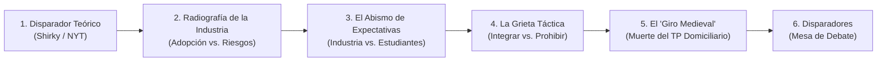

# Contenido y Guión para Diapositivas: Ateneo UNLu - UNIPE

> **Marco:** Ateneo *"IA en la segunda era de la automatización del trabajo / IA y formación en Ciencias de la Computación"* (Septiembre 2026).  
> **Insumos principales:**
> * Ensayo disparador: Clay Shirky, *"Hay una crisis de estudiantes haciendo trampa con la IA. Las universidades deben cambiar"* (*The New York Times*, Agosto 2025).
> * Datos empíricos locales: Encuesta a Profesionales de la Industria ($N=13$) y Encuesta a Estudiantes de Computación ($N=20$).  
> **Tiempo estimado de exposición:** 15–20 minutos antes de abrir la mesa de debate.

---

## Estructura Narrativa General (Storytelling con Datos)

---

## Slide 1: Portada y Marco

* **Título:** IA, Trabajo Informacional y Formación en Computación: Tensiones, Brechas y Dilemas Pedagógicos
* **Subtítulo:** Datos empíricos de profesionales de la industria ($N=13$) y estudiantes universitarios ($N=20$)
* **Expositores / Marco:** Ateneo interuniversitario UNLu - UNIPE (Septiembre 2026)
* **Objetivo de la presentación:** Presentar evidencia empírica de primera mano sobre cómo mutó la práctica profesional, qué busca el mercado en los perfiles iniciales y qué contradicciones pedagógicas se abren en nuestras aulas.

---

## Slide 2: El Disparador: De la Literatura a las Ciencias de la Computación

* **Título:** El "Esfuerzo Mental Opcional" y la Crisis de la Evaluación
* **Cita central en pantalla (Clay Shirky, *NYT*, Agosto 2025):**
  > *"El aprendizaje es un cambio en la memoria a largo plazo; ese es el correlato biológico de lo que hacemos en el aula. Ahora que la mayor parte del esfuerzo mental vinculado a la escritura es opcional, un estudiante que corta y pega un trabajo está inscripto en una clase de cortar y pegar, no en una clase de historia."*
* **Tesis del orador:**
  * Lo que Shirky describe para los ensayos humanísticos impacta de lleno en la enseñanza de la programación: **la sintaxis y la codificación mecánica básica ahora son automáticas, instantáneas y baratas**.
  * Si el código fluye mediante un prompt, ¿dónde reside el esfuerzo cognitivo necesario para aprender a programar?
  * *Transición:* Para evitar un debate puramente especulativo, salimos a consultar a la industria local y a nuestros propios estudiantes.

---

## Slide 3: La Realidad de la Industria: Alta Adopción, Cero Ingenuidad

* **Título:** Estado de Adopción: El Código Diario en la Trinchera
* **Datos clave de la muestra ($N=13$, 77% perfiles Senior/Lead):**
  * **Uso diario/intensivo en IDE:** **$69.2\%$** ($n=9$); frecuente: **$23.1\%$** ($n=3$).  
    $\rightarrow$ **$92.3\%$ de adopción activa en el trabajo cotidiano.**
  * **Política formal de la empresa:** $46.2\%$ promovido/obligatorio; $30.8\%$ permitido a criterio libre.
* **Mapa de Riesgos Percibidos (Pregunta de opción múltiple):**
  * 🔴 **69.2%** ($n=9$): **Mayor superficialidad** *(se aprueban PRs o se integra código sin comprenderlo a fondo)*.
  * 🟠 **46.2%** ($n=6$): **Aumento de deuda técnica y código duplicado** *(efecto copy-paste)*.
  * 🟡 **38.5%** ($n=5$): **Estancamiento del aprendizaje en perfiles junior** *(dependencia excesiva)*.
  * ⚪ **0.0%**: **Ningún impacto negativo** *(nadie eligió esta opción)*.
* **Mensaje clave:** Nadie en la industria es tecnófobo ni ludita: casi todos la usan a diario. Pero **nadie cree que la herramienta sea inocua**. El principal riesgo no pasa por la seguridad o las licencias, sino por la **distancia cognitiva** entre el desarrollador y el artefacto que pone en producción.

---

## Slide 4: El Fin del "Picapedrero de Código"

* **Título:** ¿Qué Vale Hoy en una Entrevista Técnica?
* **Distribución de la Habilidad más Decisiva en Selección:**
  * 🏆 **61.5%** ($n=8$): **Arquitectura de software, modelado del dominio y especificación de requerimientos.**
  * 🥈 **23.1%** ($n=3$): **Sólidos fundamentos de algoritmos, complejidad y estructuras de datos.**
  * 🥉 **7.7%** ($n=1$): **Capacidad de leer, auditar y depurar código complejo escrito por otros o por IA.**
  * ⚠️ **7.7%** ($n=1$): **Fluidez y velocidad resolutiva mediante prompting y herramientas de IA.**
* **Cita textual para proyectar:**
  > *"Considero importante modificar el enfoque de cualquier trabajo práctico cuyo principal 'desafío' sea 'escribir código'."*  
  > — **Encuestado 7** (Senior / Lead · Empresa de producto propio)
* **Mensaje clave:** Escribir código se *comoditizó*. La industria busca perfiles capaces de situarse **antes** del código (diseño, modelado formal de requerimientos) y **después** del código (auditoría crítica, verificación y testing). El programador que solo traslada especificaciones a sintaxis ya no tiene cabida.

---

## Slide 5: El Abismo de Expectativas: La Brecha Industria vs. Estudiantes

* **Título:** ¿Para Qué Mercado se Están Preparando los Estudiantes?
* **Gráficos de Contraste Directo ("Espejo"):**

### 1. Habilidad Técnica Decisiva para el Primer Empleo
| Habilidad | Profesionales ($N=13$) | Estudiantes ($N=20$) |
| :--- | :---: | :---: |
| **Arquitectura, modelado y especificación** | **61.5%** ($n=8$) | **30.0%** ($n=6$) |
| **Fundamentos de algoritmos y complejidad** | **23.1%** ($n=3$) | **10.0%** ($n=2$) |
| **Auditoría y depuración de código ajeno / IA** | **7.7%** ($n=1$) | **15.0%** ($n=3$) |
| **Manejo fluido de IA y rapidez de implementación** | **7.7%** ($n=1$) | 🔥 **45.0%** ($n=9$) |

### 2. El Dilema Curricular: Fundamentos vs. Novedad Tecnológica
| Enfoque Prioritario | Profesionales | Estudiantes |
| :--- | :---: | :---: |
| **Enfoque A: Fundamentos conceptuales, lógica formal y teoría** | **100.0%** ($n=13$) | **40.0%** ($n=8$) |
| **Enfoque B: Tecnologías vigentes de mercado, frameworks e IA aplicada** | **0.0%** | **60.0%** ($n=12$) |

* **Mensaje clave:** **Falsa ilusión de preparación.** El 45% de los estudiantes asume que su pasaporte laboral es la destreza herramental y la rapidez con asistentes de IA, mientras que el 100% de la industria responde al unísono: *"Ustedes enseñen lo difícil y conceptual, que de la herramienta nos encargamos nosotros en el trabajo"*.

---

## Slide 6: Los Arquetipos de la Industria: ¿Integrar o Prohibir?

* **Título:** La Grieta Pedagógica: Consenso en los Fines, Ruptura en los Medios
* **El dato disparador:** Ante la política docente para 1° y 2° año, la industria se parte en dos:
  * **53.8%** ($n=7$): **Prohibición en evaluaciones** *(garantizar comprensión manual de la sintaxis y la lógica algorítmica sin asistencia)*.
  * **46.2%** ($n=6$): **Integración curricular obligatoria** *(enseñar a programar CON la IA desde el primer día, con foco en auditar y verificar)*.
  * **0.0%**: **Libre albedrío** *(nadie opina que la universidad deba desregular)*.

* **Los 3 Arquetipos Conceptuales Emergentes:**
  1. **El Pragmático de Alto Nivel (5 casos · Seniors):**  
     *Postura:* La codificación artesanal ya fue automatizada. Si la industria trabaja a diario con IA, la universidad debe integrarla para concentrarse en lo que la máquina no hace: entender el problema, diseñar arquitectura y gobernar el proceso.
  2. **El Formador Protector (3 casos · Seniors con uso diario):**  
     *Postura (la paradoja productiva):* La utiliza a diario para producir, pero exige prohibirla en el ciclo inicial: para tener criterio arquitectónico y capacidad de auditoría, primero hay que haber "sufrido" la construcción artesanal del código a mano.
  3. **El Fiel a las Bases (2 casos · Juniors en Software Factory):**  
     *Postura:* Los juniors son paradójicamente los más prohibitivos. Saben por experiencia reciente que quien se apoya temprano en la IA nunca llega a desarrollar la lógica de base indispensable para resolver problemas.

---

## Slide 7: ¿Hacia un "Giro Medieval" en la Enseñanza de Programación?

* **Título:** La Crisis del Trabajo Práctico Domiciliario
* **Conexión Shirky + Testimonio de la Industria:**

> *"El cambio significa superar las tareas hechas en casa y pasar a pedirles que escriban ensayos en clase, optar por exámenes orales y volver a un modelo más antiguo y relacional de educación superior."*  
> — **Clay Shirky** (*NYT*, 2025)

> *"Ha quedado obsoleto el modelo tradicional de 'trabajo para el hogar', tanto teórico como práctico, a los efectos de lograr aprendizaje profundo (...). Las evaluaciones deben realizarse en forma presencial y sin asistencia de IA. Como primera medida, cada asignatura debería especificar de lleno una postura explícita (marcos MIT / Cornell)."*  
> — **Encuestado 9** (Senior / Lead · Software Factory)

* **Tesis del orador:**  
  * El trabajo práctico domiciliario tradicional dejó de garantizar autoría y esfuerzo cognitivo.
  * Si un TP que demandaba 10 horas de esfuerzo ahora se resuelve en minutos mediante un LLM, insistir con el mismo formato fomenta una "clase de cortar y pegar".
  * El desafío urgente: ¿Cómo construir formas de **evaluación auténtica**, seguimiento presencial del proceso y defensa oral en una carrera de computación?

---

## Slide 8: Preguntas Disparadoras para la Mesa del Ateneo

* **Título:** Tensiones Abiertas para el Debate
* **Preguntas para moderar la discusión (colegas docentes, investigadores y estudiantes):**

1. **La paradoja de la habilidad artesanal:**  
   ¿Se puede formar a un profesional con criterio arquitectónico y capacidad de auditar código complejo si previamente se le ahorró el esfuerzo artesanal de escribir y depurar miles de líneas de código básico a mano?

2. **La trampa de la demanda estudiantil:**  
   Si el 60% de los estudiantes pide "más frameworks y tecnologías de moda", pero el 100% de los seniors exige "teoría computacional y lógica formal", ¿cómo debe responder la universidad sin quedar desfasada ni caer en la complacencia instrumental?

3. **El rediseño del aula:**  
   Si el TP domiciliario quedó herido de muerte, ¿qué prácticas concretas adoptamos? ¿Giro hacia la evaluación presencial sin dispositivos, exámenes orales y defensa viva voce, o diseño de consignas donde la IA sea parte explícita del proceso evaluado?

4. **El mercado junior en jaque:**  
   Si la IA absorbe las tareas mecánicas que antes hacían los trainees y eleva la vara de autonomía requerida, ¿cómo evitamos que se rompa el puente de inserción laboral de nuestros graduados?

---

## Sugerencias para el Orador

* **Tono reflexivo y dialéctico:** Evitar presentarse como el dueño de la respuesta; el valor de la presentación reside en exponer las contradicciones objetivas reveladas por los datos.
* **El gancho de la grieta 50/50:** Resaltar que ni siquiera los propios seniors de la industria se ponen de acuerdo sobre qué hacer en 1° y 2° año. Esa división legitima la incertidumbre de los docentes y abre el espacio para un debate genuino.
